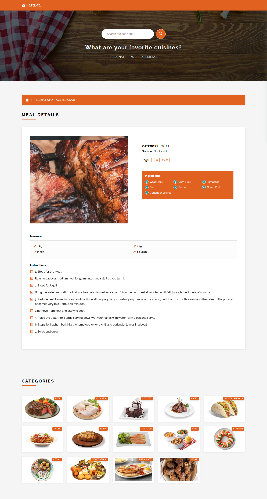

# Recipe App
<h2> About The Project</h2>
<p>This is a web application that allows a user to search for a food recipe. Popular Searches include Soup, Salad, Tacos, Fish, Beef, Salmon Sausage, Pork, Curry, Egg, Chicken, Cake, Cheese, Chocolate, Lamb, Cabbage, Peas, Lentils and so much more.</p>
<p>[Link to Live Site](https://sereyatiampati.github.io/Recipe-App/)</p>

<h2>Demo</h2>
<p></p>

<h3>Built With</h3>
Below is a list of all the technologies used to bootstrap this project.
<ul>
<li> React</li>
<li> SCSS</li>
<li> React Router</li>
<li> The Meal DB API - (https://www.themealdb.com)</li>
<li> React icons</li>
<li> Sass</li>
<li> Axios</li>
</ul>

<h2> Get Started</h2>
Setup and install the project locally by running the steps below:

### Installations

1. Clone the repo to your local machine
   ```sh
   git clone https://github.com/sereyatiampati/End-of-Phase-1-Project.git
   ```

2. Instal JSON Server globally on your machine by running this command on your terminal:
   ```sh
      npm install -g json-server
      ```

3 .Run this command on your terminal to get the JSON server running:
   ```sh
      json-server --watch db.json
   ````

4 . Then, open the `index.html` file on your browser to run the application.

<p align="right">(<a href="#readme-top">back to top</a>)</p>

<h3>Get started with searching for a Recipe for your Favourite Meal and enjoy making it for your Family and Friends! Don't forget to leave a comment and give us your feedback about your experience.</h3>

## License

Distributed under the MIT License. See `LICENSE.txt` for more information.

## Author
* **Github Profile** - [sereyatiampati](https://github.com/sereyatiampati)

## Contact
Github Project Link: [End of Phase 1 Finished Project](https://github.com/sereyatiampati/End-of-Phase-1-Project.git)

<p align="right">(<a href="#readme-top">back to top</a>)</p>

## Acknowledgments

List below are resources used and were helpful and I would like to give credit to.

* [Moringa School](https://moringaschool.com/)
* [BSD 2-Clause "Simplified" License](https://opensource.org/licenses/BSD-2-Clause)
* [Eloquent JavaScript Book](https://eloquentjavascript.net/)
* [Malven's Flexbox Cheatsheet](https://flexbox.malven.co/)
* [Malven's Grid Cheatsheet](https://grid.malven.co/)
* [Friedman's Responsive Web Design Article](https://www.smashingmagazine.com/2011/01/guidelines-for-responsive-web-design/)
* [GitHub Pages](https://pages.github.com)
* [Font Awesome](https://fontawesome.com)
* [Bootstrap](https://getbootstrap.com/)


<p align="right">(<a href="#readme-top">back to top</a>)</p>


Copyright © 2022. All rights reserved. See License file for more details.
